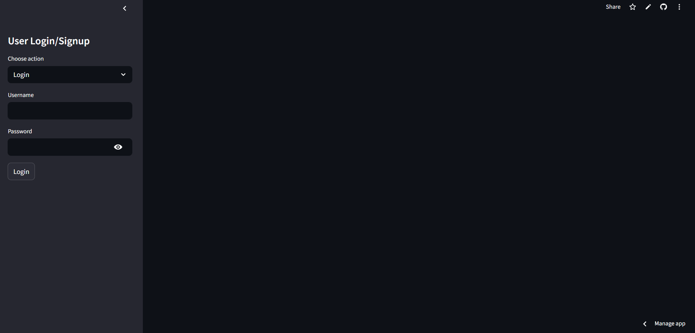
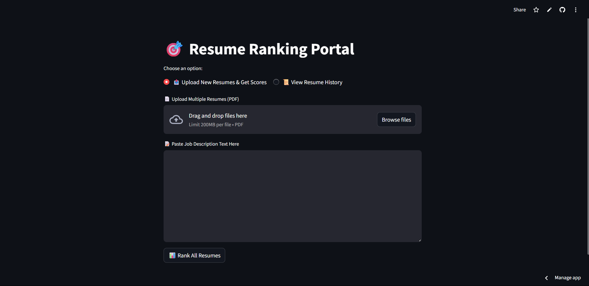
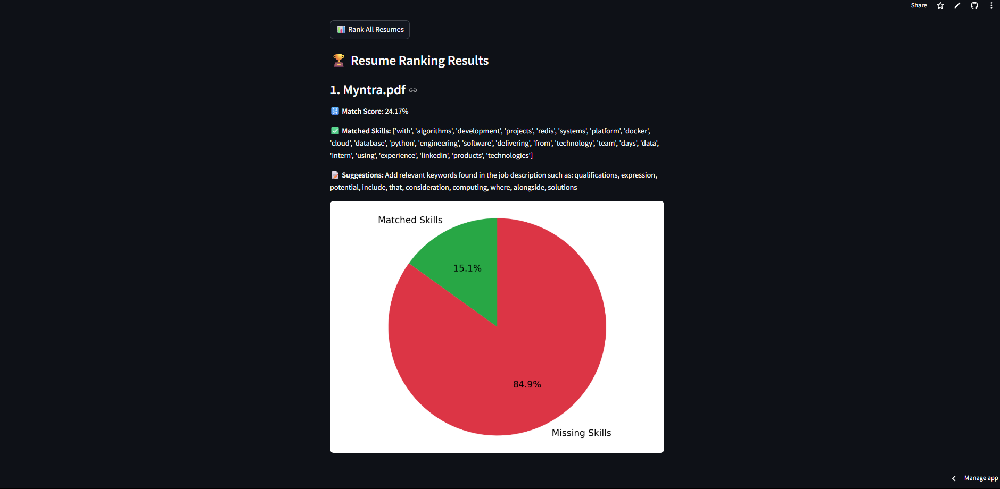

# 📂 Multi-Resume Ranker (NLP Powered)

This project helps recruiters and job seekers evaluate multiple resumes against a job description using Natural Language Processing (NLP). Upload PDFs, paste a JD, and get a ranked list with match scores, skill matches, and improvement suggestions.

## 🚀 Features

- 📄 Upload multiple resumes in PDF format
- 📝 Paste a Job Description (JD)
- 🧠 Extracts and compares keywords using NLP
- 📊 Calculates similarity scores between resumes and the JD
- ✅ Displays matched skills and offers resume improvement suggestions
- 📈 Visual insights via pie charts
- 🔐 Built-in user login/signup system with per-user resume history tracking

## 🛠️ Technologies Used

- Streamlit (Web App)
- NLTK (Keyword Extraction)
- Scikit-learn (TF-IDF + Cosine Similarity)
- Python
- Matplotlib (Charts)

## 📦 Installation

```bash
git clone https://github.com/your-username/resume-ranker.git
cd resume-ranker
pip install -r requirements.txt
```
## 📷 Screenshots
### 🔐 Login & Signup Page


### 📄 Resume Upload & Job Description


### 📊 Resume Ranking Results


## 📁 Project Structure
resume-ranker/  
│       
├── app.py  
├── ranker.py       
├── user_auth.py             
├── utils.py               
├── requirements.txt    
└── README.md

🧠 Future Improvements
Resume parsing with spaCy or PyMuPDF

Integration with cloud storage

Exporting results as CSV

Feedback-based adaptive ranking

👤 Author
Pavan Gannoju

🌐 Live App
Once deployed on Streamlit Cloud:
Visit the App: (https://resumeranker.streamlit.app/)